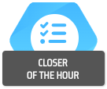
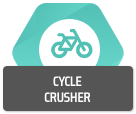
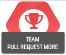

# devActivity Achievement Badges

## **ONBOARDING CHALLENGES (ONE-TIME)**

| Badge | Title | Conditions to Earn | XP Reward |
|---|---|---|---|
|  | HELLO WORLD! | Add your first commit | +3 XP |
|  | PULL REQUEST PRODIGY | Push your first pull request | +3 XP |
|  | CAPTAIN CODE | Complete your first code review | +3 XP |
|  | ROGER THAT! | Add your first comment on a PR or issue | +3 XP |
|  | CLOSER OF THE HOUR | Close your first issue | +3 XP |
|  | PANDORA BOX OPENED | Create your first issue | +3 XP |
|  | TROUBLE SHOOTER | Resolve your first alert | +3 XP |
|  | HIGH FIVE | Assign your first Recognition Award | +3 XP |
|  | AWESOME ALLY | Receive your first Recognition Award | +3 XP |
|  | CAREER ADVISOR | Create your first performance review | +10 XP |

## **INDIVIDUAL CHALLENGES (MONTHLY)**

| Badge | Title | Conditions to Earn | XP Reward |
|---|---|---|---|
|  | CONTRIBUTION CHALLENGER | Earn more than N XP in a month | +3% of your total XP |
|  | COMMIT MORE | Make more than N commits in a month | +3% of your total XP |
|  | PULL REQUEST MORE | Submit more than N pull requests in a month | +2% of your total XP |
|  | CODE REVIEW MORE | Complete more than N code reviews in a month | +3% of your total XP |
|  | CYCLE CRUSHER | Average pull request Cycle Time is below N hours | +3% of your total XP |
|  | REVIEW ACCELERATOR | Average pull request Review Time is below N hours | +3% of your total XP |
|  | ERRORLESS | Successfully merge N consecutive pull requests without any errors | +3% of your total XP |
|  | ROCKSTAR | Assign more than N Recognition Awards in a month | +3% of your total XP |
|  | LIGHTNING | Submit the fastest pull request | +3% of your total XP |
|  | HOT POTATO | Complete the fastest code review | +3% of your total XP |
|  | SPEEDY SOLVER | Close an issue in the fastest time | +3% of your total XP |
|  | ARCHEOLOGIST | Close the oldest outstanding issue | +2% of your total XP |
|  | FIRE EXTINGUISHER | Resolve the most alerts | +2% of your total XP |
|  | ISSUE TERMINATOR | Close the most issues | +2% of your total XP |
|  | COMMENTS GURU | Add the most comments to PRs and issues | +2% of your total XP |
|  | THE BOUNTY HUNTER | Close the most issues labeled as bugs | +2% of your total XP |

## **TEAM CHALLENGES (MONTHLY)**

| Badge | Title | Conditions to Earn | XP Reward |
|---|---|---|---|
|  | TEAM CONTRIBUTION | Team's total XP is above N | +3% of your total XP |
|  | TEAM PULL REQUEST MORE | Team submits more than N PRs in a month | +2% of your total XP |
|  | CYCLE SLASHERS | Team's average pull request Cycle Time is below N hours | +3% of your total XP |

## **ACCUMULATIVE CHALLENGES**

| Badge | Title | Conditions to Earn | XP Reward |
|---|---|---|---|
|  | YEARS CLUB | Achieve consecutive N years of active contribution | +9% of your total XP |
|  | CONTRIBS CLUB | Consistently make significant contributions over time | +3% of your total XP |
|  | RECOGNITION AWARD CLUB | Consistently earn Recognition Awards over time | +3% of your total XP | 

**Note:** 
- XP Rewards are a percentage of your total monthly earned XP. 
- Specific numbers are subject to change.  
